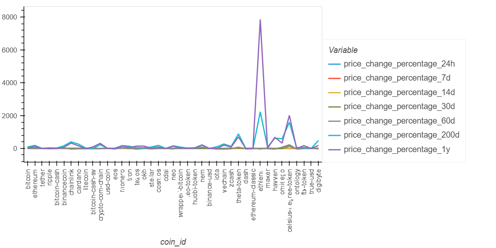
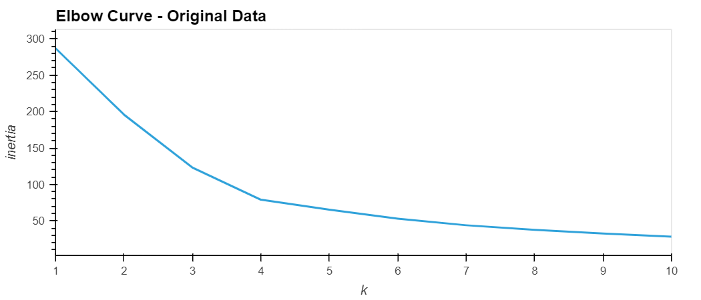
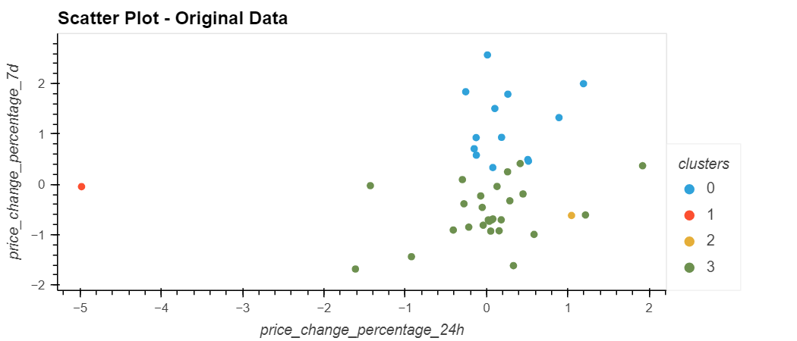
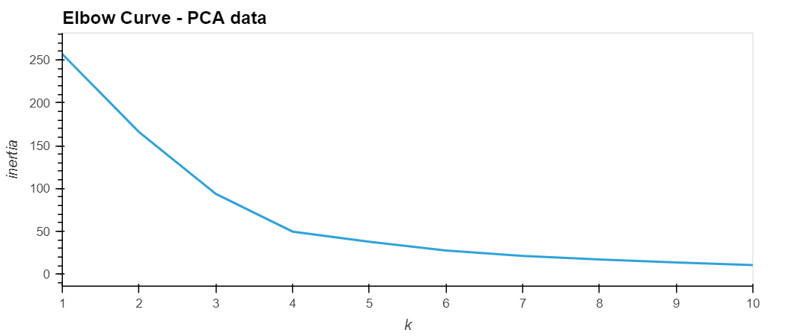
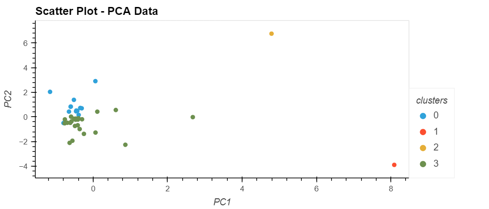

# Cryptocurrency Clustering

This challenge is completed as requirement of Data Analytics Boot Camp at University of Toronto.

In this assignment, I have used my knowledge of Python and unsupervised learning to predict if cryptocurrencies are affected by 24-hour or 7-day price changes.

Following steps are followed in creating the predictions using Unsupervised Learning model:

## Setp 1: Read the Data

This step involves the following:

- Import the dependencies and required libraries.

- Load the market data into a DataFrame and display the sample data.

- Get the summary statistics.

- Plot the data to see what the data looks like before proceeding which is as under:

## Step 2: Prepare the Data

The data is prepared by completing the tasks as follows:

- Use the StandardScaler() module from scikit-learn to normalize the data from the CSV file.

- Create a DataFrame with the scaled data.

- Set the "coin_id" index from the original DataFrame as the index for the new DataFrame.

## Step 3: Find the Best Value for k Using the Original Scaled DataFrame

I used the elbow method to find the best value for k using the following steps:

- Create a list with the number of k values from 1 to 11.

- Create an empty list to store the inertia values.

- Create a for loop to compute the inertia with each possible value of k.

- Create a dictionary with the data to plot the elbow curve.

- Plot a line chart with all the inertia values computed with the different values of k to visually identify the optimal value for k.

- The best value for k is identified as 4 as can be inferred from the elbow curve displayed below:

## Step 4: Cluster Cryptocurrencies with K-means Using the Original Scaled Data

I used the following steps to cluster the cryptocurrencies for the best value for k on the original scaled data:

- Initialize the K-means model with the best value for k (which is 4).

- Fit the K-means model using the original scaled DataFrame.

- Predict the clusters to group the cryptocurrencies using the original scaled DataFrame.

- Create a copy of the original data and add a new column with the predicted clusters.

- Create a scatter plot using hvPlot as follows:

    - Set the x-axis as "price_change_percentage_24h" and the y-axis as "price_change_percentage_7d".

    - Color the graph points with the labels found using K-means.

    - Add the "coin_id" column in the hover_cols parameter to identify the cryptocurrency represented by each data point.

The scatter chart created shows the clusters as under:

## Step 5: Optimize Clusters with Principal Component Analysis

The clusters are optimized with PCA by completing the following steps:

- Using the original scaled DataFrame, perform a PCA and reduce the features to three principal components.

- Retrieve the explained variance to determine how much information can be attributed to each principal component. About 89.5% of the total variance is considered into the 3 PCA variables.

- Create a new DataFrame with the PCA data and set the "coin_id" index from the original DataFrame as the index for the new DataFrame.

## Step 6: Find the Best Value for k Using the PCA Data

I used the elbow method on the PCA data to find the best value for k using the following steps:

- Create a list with the number of k-values from 1 to 11.

- Create an empty list to store the inertia values.

- Create a for loop to compute the inertia with each possible value of k.

- Create a dictionary with the data to plot the Elbow curve.

- Plot a line chart with all the inertia values computed with the different values of k to visually identify the optimal value for k.

- The best value for k when using the PCA data can be identified as 4 as shown in the elbow curve below. This is similar to the best k value found using the original data.

## Step 7: Cluster Cryptocurrencies with K-means Using the PCA Data

I used the following steps to cluster the cryptocurrencies for the best value for k on the PCA data:

- Initialize the K-means model with the best value for k.

- Fit the K-means model using the PCA data.

- Predict the clusters to group the cryptocurrencies using the PCA data.

- Create a copy of the DataFrame with the PCA data and add a new column to store the predicted clusters.

- Create a scatter plot using hvPlot as follows:

    - Set the x-axis as "PC1" and the y-axis as "PC2".

    - Color the graph points with the labels found using K-means.

    - Add the "coin_id" column in the hover_cols parameter to identify the cryptocurrency represented by each data point.

The scatter chart created shows the clusters as under:

## Step 7: Visualize and Compare the Results

The results are visualized and compared by completing the following steps:

- Create a composite plot by using hvPlot and the plus sign (+) operator to compare the elbow curve created from the original data with the one created from the PCA data.

- Create a composite plot by using hvPlot and the plus (+) operator to compare the cryptocurrency clusters that resulted from using the original data with those that resulted from the PCA data.

Based on visually analyzing the cluster analysis results, following is the impact of using fewer features to cluster the data by using K-means:

**Although the elbow curves are identical for both sets of data, we can conclude that we can use less features (with PCA) and get a relatively better performance to the original model since we can identify four clusters in a better manner. The data is grouped in cryptocurrency clusters in both cases, however, the clusters with PCA data are more close and clear, especially, the third cluster for *celsius-degree-token* is clearly differentiated from the other clusters using PCA data.**